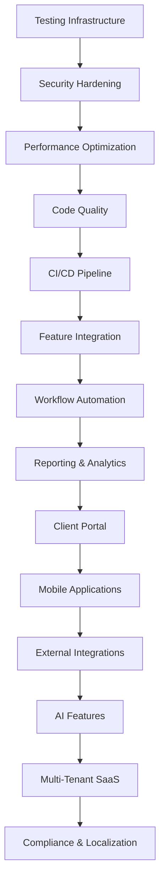

# Legal Case Management System - Feature Planning Roadmap

## Executive Summary

This document provides comprehensive feature planning for transforming the Legal Case Management System from Maturity Level 2.5/5 to 4.5/5 over 12 months. It includes detailed user stories, acceptance criteria, technical specifications, and success metrics for all major features.

---

## Feature Prioritization Matrix (MoSCoW Method)

### Must Have (Critical - Months 1-4)
- **Testing Infrastructure** - Foundation for quality
- **Security Hardening** - Risk mitigation
- **Performance Optimization** - User retention
- **Code Quality Improvement** - Technical debt reduction
- **CI/CD Pipeline** - Development efficiency
- **Feature Integration** - Core functionality

### Should Have (Important - Months 5-8)
- **Workflow Automation** - Business value
- **Reporting & Analytics** - Decision making
- **Client Portal** - Customer satisfaction
- **Mobile Applications** - Market competitiveness

### Could Have (Nice to Have - Months 9-12)
- **External Integrations** - Ecosystem expansion
- **AI & Advanced Features** - Differentiation
- **Multi-Tenant SaaS** - Scalability
- **Compliance & Localization** - Global expansion

### Won't Have (This Release)
- Advanced AI legal research (beyond document analysis)
- Complex court system integrations
- Blockchain-based evidence management

---

## Detailed Feature Specifications

### 1. Testing Infrastructure (Priority: Must Have)

#### User Stories:
**As a developer**, I want comprehensive test coverage so that I can deploy with confidence.
- **Story Points**: 8
- **Epic**: Foundation & Stabilization
- **Dependencies**: None

**As a QA engineer**, I want automated testing pipelines so that I can catch bugs early.
- **Story Points**: 5
- **Epic**: Foundation & Stabilization
- **Dependencies**: Testing framework setup

#### Acceptance Criteria:
- [ ] Backend test coverage ≥ 80%
- [ ] Frontend test coverage ≥ 75%
- [ ] All REST endpoints have integration tests
- [ ] E2E tests cover critical user journeys
- [ ] Automated test execution in CI/CD
- [ ] Test reports generated automatically
- [ ] Performance regression tests included

#### Technical Specifications:
```yaml
Backend Testing Stack:
  - JUnit 5 + Mockito
  - Spring Boot Test
  - TestContainers for DB tests
  - JaCoCo for coverage
  - WireMock for external services

Frontend Testing Stack:
  - Karma + Jasmine
  - Cypress for E2E
  - Angular Testing Utilities
  - Istanbul for coverage
  - Mock services
```

#### API Specifications:
```yaml
Test Data API:
  - POST /api/test/setup - Create test data
  - DELETE /api/test/cleanup - Remove test data
  - GET /api/test/status - Check test environment
```

#### Success Metrics:
- Test execution time < 15 minutes
- Bug detection rate increase by 60%
- Production incidents reduction by 70%
- Developer confidence score > 4.5/5

### 2. Security Hardening (Priority: Must Have)

#### User Stories:
**As a system administrator**, I want comprehensive security controls so that client data remains protected.
- **Story Points**: 13
- **Epic**: Foundation & Stabilization
- **Dependencies**: Testing Infrastructure

**As a compliance officer**, I want audit trails so that I can demonstrate regulatory compliance.
- **Story Points**: 8
- **Epic**: Foundation & Stabilization
- **Dependencies**: Security logging framework

#### Acceptance Criteria:
- [ ] File upload validation (type, size, virus scan)
- [ ] Path traversal prevention implemented
- [ ] API rate limiting active
- [ ] CSRF protection on all endpoints
- [ ] Security headers configured
- [ ] Data encryption at rest
- [ ] SQL injection prevention
- [ ] Security audit logging
- [ ] Penetration testing suite

#### Technical Specifications:
```yaml
Security Framework:
  - Spring Security 6.x
  - OAuth 2.0 + JWT
  - Redis for rate limiting
  - AES-256 encryption
  - OWASP security headers
  - ClamAV for virus scanning
  
Rate Limiting:
  - 100 requests/minute per user
  - 1000 requests/minute per organization
  - Sliding window algorithm
  - Redis-based storage
```

#### Data Model:
```sql
CREATE TABLE security_audit_log (
  id BIGINT PRIMARY KEY,
  user_id BIGINT,
  action VARCHAR(100),
  resource VARCHAR(255),
  ip_address VARCHAR(45),
  user_agent TEXT,
  timestamp TIMESTAMP,
  success BOOLEAN,
  details JSON
);
```

#### Success Metrics:
- Zero critical vulnerabilities
- Security scan passing rate 100%
- Failed login attempts blocked
- Data breach incidents: 0

### 3. Performance Optimization (Priority: Must Have)

#### User Stories:
**As a user**, I want fast response times so that I can work efficiently.
- **Story Points**: 10
- **Epic**: Foundation & Stabilization
- **Dependencies**: Caching infrastructure

**As a system administrator**, I want the system to handle peak loads without degradation.
- **Story Points**: 8
- **Epic**: Foundation & Stabilization
- **Dependencies**: Performance monitoring

#### Acceptance Criteria:
- [ ] API response times < 200ms (95th percentile)
- [ ] Page load times < 2 seconds
- [ ] Database query optimization complete
- [ ] Redis caching implemented
- [ ] Lazy loading for all modules
- [ ] Virtual scrolling for large lists
- [ ] Bundle size < 500KB per module
- [ ] PWA features implemented

#### Technical Specifications:
```yaml
Caching Strategy:
  - Redis for session data
  - Application-level caching for reference data
  - Database query result caching
  - Browser caching with proper headers
  
Database Optimization:
  - Index analysis and optimization
  - Query plan analysis
  - Connection pooling (HikariCP)
  - Read replicas for reporting
```

#### Success Metrics:
- Page load time improvement: 60%
- API response time improvement: 50%
- Concurrent user capacity: 500+
- System availability: 99.9%

### 4. Workflow Automation (Priority: Should Have)

#### User Stories:
**As a case manager**, I want automated case workflows so that I don't miss critical steps.
- **Story Points**: 21
- **Epic**: Advanced Features
- **Dependencies**: Feature Integration

**As a partner**, I want automated approval processes so that billing is accurate and timely.
- **Story Points**: 13
- **Epic**: Advanced Features
- **Dependencies**: Time tracking integration

#### Acceptance Criteria:
- [ ] Case status workflow engine operational
- [ ] Time entry approval workflows
- [ ] Deadline reminder automation
- [ ] Case assignment rule engine
- [ ] Document approval workflows
- [ ] Conflict checking automation
- [ ] Case intake automation
- [ ] Billing cycle automation
- [ ] SLA monitoring and alerts

#### Technical Specifications:
```yaml
Workflow Engine:
  - State machine pattern
  - Event-driven architecture
  - Async processing with RabbitMQ
  - Workflow definition in YAML/JSON
  - Rule engine for business logic

Workflow States:
  Case Management:
    - New → Assigned → In Progress → Review → Closed
    - Parallel tracks for different case types
  
  Time Approval:
    - Submitted → Manager Review → Partner Approval → Billed
```

#### Data Model:
```sql
CREATE TABLE workflow_definitions (
  id BIGINT PRIMARY KEY,
  name VARCHAR(100),
  entity_type VARCHAR(50),
  definition JSON,
  version INTEGER,
  active BOOLEAN,
  created_date TIMESTAMP
);

CREATE TABLE workflow_instances (
  id BIGINT PRIMARY KEY,
  workflow_definition_id BIGINT,
  entity_id BIGINT,
  current_state VARCHAR(50),
  state_data JSON,
  created_date TIMESTAMP,
  updated_date TIMESTAMP
);
```

#### Success Metrics:
- Workflow completion rate: 95%
- Manual intervention reduction: 60%
- Process cycle time reduction: 40%
- User satisfaction with automation: 4.2/5

### 5. Client Portal (Priority: Should Have)

#### User Stories:
**As a client**, I want to view my case status so that I stay informed about progress.
- **Story Points**: 13
- **Epic**: Customer Experience
- **Dependencies**: Security framework, case management

**As a client**, I want to securely share documents so that I can collaborate with my legal team.
- **Story Points**: 8
- **Epic**: Customer Experience
- **Dependencies**: Document management, security

#### Acceptance Criteria:
- [ ] Secure client authentication
- [ ] Case status dashboard
- [ ] Document upload/download
- [ ] Secure messaging system
- [ ] Invoice viewing and payment
- [ ] Appointment scheduling
- [ ] Client intake forms
- [ ] Multi-language support
- [ ] Mobile-responsive design

#### Technical Specifications:
```yaml
Architecture:
  - Separate Angular application for client portal
  - Shared authentication with main system
  - API-first design
  - Progressive Web App (PWA)
  - Multi-language support (i18n)

Security:
  - Client-specific data isolation
  - Document access controls
  - Secure file sharing with expiration
  - Two-factor authentication option
```

#### API Specifications:
```yaml
Client Portal API:
  - GET /api/client/cases - List client cases
  - GET /api/client/cases/{id} - Case details
  - POST /api/client/documents - Upload document
  - GET /api/client/invoices - List invoices
  - POST /api/client/messages - Send message
  - GET /api/client/appointments - List appointments
```

#### Success Metrics:
- Client portal adoption rate: 70%
- Client satisfaction score: 4.5/5
- Support ticket reduction: 30%
- Document sharing efficiency: 50% improvement

### 6. AI & Advanced Features (Priority: Could Have)

#### User Stories:
**As a lawyer**, I want AI-powered document analysis so that I can quickly understand key information.
- **Story Points**: 21
- **Epic**: Differentiation
- **Dependencies**: Document management, ML infrastructure

**As a case manager**, I want predictive analytics so that I can better plan resources.
- **Story Points**: 13
- **Epic**: Differentiation
- **Dependencies**: Analytics framework, historical data

#### Acceptance Criteria:
- [ ] Document classification with 90% accuracy
- [ ] Key information extraction from documents
- [ ] Case outcome prediction models
- [ ] Intelligent search functionality
- [ ] Automated time entry suggestions
- [ ] Contract analysis features
- [ ] Anomaly detection for billing
- [ ] Legal research assistant chatbot

#### Technical Specifications:
```yaml
AI/ML Stack:
  - Python ML services (FastAPI)
  - Natural Language Processing (spaCy, transformers)
  - Document classification (scikit-learn)
  - Vector database for semantic search (Pinecone/Weaviate)
  - OpenAI API integration for advanced features

Models:
  - Document Classification: Legal document types
  - Named Entity Recognition: Parties, dates, amounts
  - Sentiment Analysis: Client communication
  - Predictive Models: Case duration, outcome probability
```

#### Success Metrics:
- Document processing time reduction: 70%
- Classification accuracy: >90%
- User adoption of AI features: 60%
- Time savings per user: 2 hours/week

### 7. Multi-Tenant SaaS Platform (Priority: Could Have)

#### User Stories:
**As a SaaS administrator**, I want tenant isolation so that customer data remains separate.
- **Story Points**: 34
- **Epic**: Platform Transformation
- **Dependencies**: All previous features

**As a customer**, I want customizable branding so that the system reflects my firm's identity.
- **Story Points**: 13
- **Epic**: Platform Transformation
- **Dependencies**: UI framework, tenant management

#### Acceptance Criteria:
- [ ] Complete data isolation between tenants
- [ ] Subscription management system
- [ ] Usage-based billing integration
- [ ] Tenant administration portal
- [ ] White-labeling capabilities
- [ ] Tenant-specific customizations
- [ ] Automated onboarding process
- [ ] Platform monitoring dashboard

#### Technical Specifications:
```yaml
Multi-Tenancy Strategy:
  - Database per tenant (isolation level 1)
  - Shared application, separate schemas
  - Tenant identification via subdomain
  - Dynamic datasource routing
  - Tenant-specific configuration

Subscription Management:
  - Integration with Stripe/Chargebee
  - Usage tracking and metering
  - Automated billing cycles
  - Plan upgrades/downgrades
  - Trial period management
```

#### Data Model:
```sql
CREATE TABLE tenants (
  id BIGINT PRIMARY KEY,
  subdomain VARCHAR(100) UNIQUE,
  name VARCHAR(255),
  subscription_plan VARCHAR(50),
  billing_status VARCHAR(20),
  custom_domain VARCHAR(255),
  settings JSON,
  created_date TIMESTAMP
);

CREATE TABLE tenant_usage (
  id BIGINT PRIMARY KEY,
  tenant_id BIGINT,
  metric_name VARCHAR(100),
  value BIGINT,
  period_start TIMESTAMP,
  period_end TIMESTAMP
);
```

#### Success Metrics:
- Tenant provisioning time: <5 minutes
- Data isolation compliance: 100%
- Multi-tenant performance overhead: <10%
- Subscription conversion rate: 25%

---

## Release Planning Schedule

### Release 1.0 (Month 4) - Foundation
**Theme**: Stability and Security
- Testing Infrastructure
- Security Hardening
- Performance Optimization
- Code Quality Improvements
- CI/CD Pipeline

### Release 2.0 (Month 6) - Integration
**Theme**: Connected Experience
- Feature Integration
- Workflow Automation (Phase 1)
- Basic Reporting

### Release 3.0 (Month 8) - User Experience
**Theme**: Enhanced Usability
- Advanced Reporting & Analytics
- Client Portal
- Mobile Applications (MVP)

### Release 4.0 (Month 10) - Intelligence
**Theme**: Smart Features
- External Integrations
- AI & Advanced Features (Phase 1)
- Advanced Workflow Automation

### Release 5.0 (Month 12) - Platform
**Theme**: Scalable SaaS
- Multi-Tenant Architecture
- Advanced AI Features
- Compliance & Localization

---

## Feature Dependencies Matrix



---

## Technical Architecture Planning

### API Design Standards
```yaml
REST API Guidelines:
  - Resource-based URLs
  - HTTP status codes (200, 201, 400, 401, 403, 404, 500)
  - Consistent error response format
  - API versioning (v1, v2)
  - OpenAPI documentation
  - Rate limiting headers
  - CORS configuration

Response Format:
  Success: { data: {}, meta: { total, page, limit } }
  Error: { error: { code, message, details } }
```

### Data Model Conventions
```yaml
Database Standards:
  - Snake_case for table and column names
  - Primary keys: BIGINT id
  - Foreign keys: table_name_id
  - Timestamps: created_date, updated_date
  - Soft deletes: deleted_date
  - Audit fields: created_by, updated_by
  - JSON columns for flexible data
```

### Security Requirements
```yaml
Authentication & Authorization:
  - OAuth 2.0 + JWT tokens
  - Role-based access control (RBAC)
  - Multi-factor authentication
  - Session management
  - Password policies
  - Account lockout policies

Data Protection:
  - Encryption in transit (TLS 1.3)
  - Encryption at rest (AES-256)
  - PII data masking
  - Audit logging
  - Data retention policies
```

---

## Success Metrics Framework

### Feature Adoption Metrics
```yaml
Primary KPIs:
  - Feature usage rate (target: >60%)
  - User engagement score (target: 4.2/5)
  - Task completion rate (target: >90%)
  - Time to value (target: <1 week)

Secondary KPIs:
  - Feature discovery rate
  - Help documentation usage
  - Support ticket volume
  - User retention by feature
```

### Performance Metrics
```yaml
Technical KPIs:
  - API response time P95 (<200ms)
  - Page load time (<2s)
  - System availability (>99.9%)
  - Error rate (<0.1%)

Business KPIs:
  - Monthly Active Users growth
  - Customer satisfaction (>4.5/5)
  - Revenue per user
  - Churn rate (<5%)
```

### A/B Testing Strategy
```yaml
Testing Framework:
  - Feature flags for gradual rollout
  - A/B testing for UI changes
  - Multivariate testing for complex features
  - Statistical significance requirements
  - Minimum test duration: 2 weeks
  - Sample size calculations
```

---

## Risk Mitigation Planning

### Technical Risks
```yaml
High Risk:
  - Data migration complexity
    Mitigation: Comprehensive testing, rollback procedures
  
  - Multi-tenant data isolation
    Mitigation: Security audits, automated testing
  
  - AI model accuracy
    Mitigation: Human oversight, confidence thresholds

Medium Risk:
  - Third-party integration failures
    Mitigation: Circuit breakers, fallback mechanisms
  
  - Mobile app store approval
    Mitigation: Early submission, compliance review
```

### Business Risks
```yaml
High Risk:
  - Feature complexity overwhelming users
    Mitigation: Progressive disclosure, user training
  
  - Competitive feature parity
    Mitigation: Unique AI features, superior UX

Medium Risk:
  - Market timing for advanced features
    Mitigation: Customer validation, flexible roadmap
```

---

## Next Steps

1. **Immediate Actions (Week 1)**
   - Stakeholder review and approval
   - Team assignment to features
   - Development environment setup
   - Initial sprint planning

2. **Short-term Goals (Month 1)**
   - Begin Testing Infrastructure implementation
   - Security audit and planning
   - Performance baseline establishment
   - User research validation

3. **Medium-term Milestones (Months 2-6)**
   - Foundation features delivery
   - User feedback integration
   - Market validation of advanced features
   - Technical architecture refinement

4. **Long-term Objectives (Months 7-12)**
   - Advanced feature rollout
   - Platform transformation
   - Market expansion preparation
   - Continuous improvement cycle

This feature planning roadmap provides a comprehensive guide for transforming the Legal Case Management System into a market-leading solution while maintaining focus on user value and technical excellence.