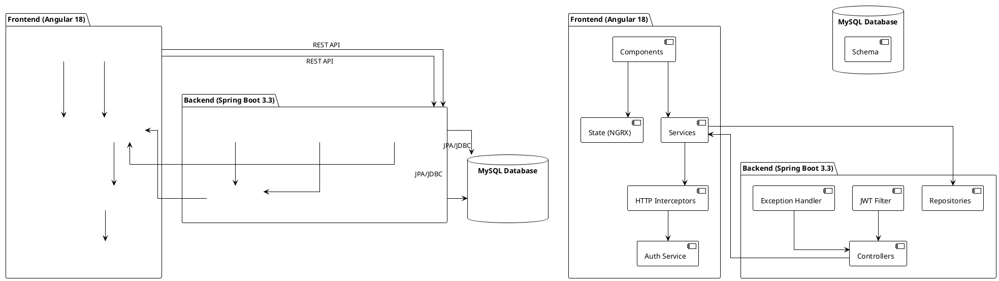

# Bostoneo Solutions Technical Brief

## High-Level Architecture Diagram



## Domain Model

| Entity | Primary Key | Key Attributes | Relationships |
|--------|------------|----------------|--------------|
| User | id (BIGINT) | email, firstName, lastName, password, enabled, nonLocked | OneToMany: UserRoles, UserEvents |
| Customer | id (BIGINT) | name, email, type, status | OneToMany: Invoice, LegalCase |
| LegalCase | id (BIGINT) | caseNumber, title, status, priority, type | ManyToOne: Customer |
| Invoice | id (BIGINT) | invoiceNumber, total, status | ManyToOne: Customer |
| Role | id (BIGINT) | name, permission | ManyToMany: User (via UserRoles) |
| UserEvent | id (BIGINT) | device, ipAddress, createdAt | ManyToOne: User, Event |
| Event | id (BIGINT) | type, description | OneToMany: UserEvent |

## Backend Breakdown

### Package Structure

```
com.bostoneo.bostoneosolutions
├── configuration - Security and application config
├── constant - Application constants
├── dto - Data Transfer Objects
├── dtomapper - Mappers between entities and DTOs
├── enumeration - Enum definitions (CaseStatus, etc.)
├── event - Event handling
├── exception - Custom exceptions and handling
├── filter - Security filters (JWT)
├── form - Form data structures
├── handler - Security handlers 
├── listener - Event listeners
├── model - Domain model classes
├── provider - Service providers
├── query - JPQL/SQL query definitions
├── repository - Data access layer
├── resource - REST controllers
├── rowmapper - JDBC row mappers
├── service - Business logic layer
├── utils - Utility classes
```

### Key Classes

#### Controller (Resource) Layer
- `UserResource` - User management, authentication, registration, profile management
- `CustomerResource` - Customer CRUD operations, listing, filtering
- `LegalCaseResource` - Legal case management, status updates, reporting
- `AnalyticsResource` - Business analytics and reporting

#### Service Layer
- `UserServiceImpl` - User authentication, registration, profile management
- `CustomerServiceImpl` - Customer management business logic
- `LegalCaseServiceImpl` - Legal case workflow and management

#### Repository Layer
- `UserRepositoryImpl` - User data access using JDBC
- `CustomerRepositoryImpl` - Customer data access
- `LegalCaseRepositoryImpl` - Legal case data access and query operations

### Security Configuration

- **Authentication**: JWT-based (Java-JWT/Auth0) with BCrypt password encoding
- **Authorization Filters**:
  - `CustomAuthorizationFilter` - Validates JWT tokens
  - `CustomAccessDeniedHandler` - Handles unauthorized access
  - `CustomAuthenticationEntryPoint` - Manages authentication failures
- **Role-Based Access Control**:
  - Permission-based security with fine-grained access controls
  - Method-level security annotations (@PreAuthorize)
- **CORS Configuration**: Configured for specific origins (localhost, bostoneosolutions.org)

### Exception Handling Strategy

- Custom exceptions with centralized exception handling
- HTTP response objects with standardized error messages
- Global exception handler with custom responses for different exception types

## Database Schema

### Configuration

- MySQL database with UTF8MB4 encoding
- Schema initialized via SQL scripts (schema.sql)
- Data population scripts for test/dev environments

### Key Tables

- `Users` - User accounts and profiles
- `Customer` - Client information
- `Invoice` - Billing records
- `LegalCases` - Legal case tracking
- `Roles` & `UserRoles` - Security roles and permissions
- `Events` & `UserEvents` - Audit trail and activity tracking
- `AccountVerifications`, `ResetPasswordVerifications`, `TwoFactorVerifications` - Security verification

### Constraints & Indexes

- Foreign key constraints with cascade delete/update policies
- Unique constraints on email, usernames, and business identifiers
- Indexes on frequent lookup fields

## Frontend Breakdown

### Angular Workspace Structure

```
src/app/
├── component/ - UI components
│   ├── auth/ - Authentication components
│   ├── customer/ - Customer management
│   ├── invoice/ - Invoice handling
│   ├── layouts/ - Page templates and layouts
│   └── profile/ - User profile management
├── core/ - Core functionality
├── enum/ - TypeScript enums
├── guard/ - Route guards
├── interface/ - TypeScript interfaces
├── interceptor/ - HTTP interceptors
├── modules/ - Feature modules
├── pipes/ - Custom pipes
├── service/ - API services
├── shared/ - Shared components
└── store/ - NGRX state management
```

### State Management

- **NGRX Store**: Centralized state management for layout and UI state
- **Component-level State**: For local component state
- **Store Structure**:
  - Layout state for UI configuration
  - Action creators and reducers for state mutations

### Key Components

#### Smart Components
- Auth components (login, register, reset-password)
- Customer management dashboard
- Legal case tracking and management
- Invoice creation and management

#### Dumb Components
- Form components with validation
- Table and list views
- Modal dialogs and alerts
- Dashboard widgets and cards

### Theme and Styling

- Based on Velzon admin template
- Bootstrap 5.3.3 for grid and components
- Custom SCSS for branding and overrides
- Responsive design with mobile support
- Integration with multiple third-party UI libraries:
  - ng-bootstrap
  - ngx-toastr
  - Angular Material components
  - Various charting libraries (ApexCharts, Chart.js)

## API Surface

### Authentication
- `POST /user/login` - User authentication
- `POST /user/register` - New user registration
- `GET /user/verify/account/{key}` - Account verification
- `POST /user/reset-password` - Password reset request

### User Management
- `GET /user/profile` - Get current user profile
- `POST /user/update` - Update user profile
- `GET /user/list` - List all users (admin)
- `DELETE /user/delete/{id}` - Delete user (admin)

### Customer Management
- `GET /customer/list` - List all customers
- `GET /customer/{id}` - Get customer details
- `POST /customer/add` - Add new customer
- `PUT /customer/update` - Update existing customer
- `DELETE /customer/delete/{id}` - Delete customer

### Legal Case Management
- `GET /case/list` - List all legal cases
- `GET /case/{id}` - Get case details
- `POST /case/add` - Create new case
- `PUT /case/update` - Update case details
- `PUT /case/status/{id}` - Update case status

### Invoice Management
- `GET /invoice/list` - List all invoices
- `GET /invoice/{id}` - Get invoice details
- `POST /invoice/create` - Create new invoice
- `PUT /invoice/update` - Update invoice details

### Analytics
- `GET /analytics/stats` - Get system statistics
- `GET /analytics/revenue` - Get revenue analytics

## Build & Deploy Pipeline

### Build Process
- Angular CLI for frontend builds
- Maven for backend builds
- Docker containerization

### Deployment
- Docker Compose for local development
- Shell scripts for environment-specific deployment:
  - `start-dev.sh`
  - `start-prod.sh`
  - `start-test.sh`

### Environment Configuration
- Spring profiles for environment-specific settings:
  - `application-dev.yml`
  - `application-prod.yml`
  - `application-test.yml`

## Cross-Cutting Concerns

### Logging
- SLF4J + Logback for backend logging
- Configured in logback-spring.xml
- Console and file appenders

### Security
- JWT-based authentication
- Role-based authorization
- MFA support (Two-factor verification)
- Password reset workflows
- Account verification

### Error Handling
- Centralized error handling
- HTTP status code mapping
- Consistent error response format

## Known Technical Debt & Extension Points

### Technical Debt
- No comprehensive test coverage
- Manual database migration scripts
- Potentially missing documentation

### Extension Points
- Expense management module (partially implemented)
- Vendor management
- Document management system
- Mobile app integration
- Reporting and analytics enhancements

## Glossary & Acronyms

| Term | Definition |
|------|------------|
| MFA | Multi-Factor Authentication |
| JWT | JSON Web Token |
| DTO | Data Transfer Object |
| RBAC | Role-Based Access Control |
| SPA | Single Page Application | 